# Dota 2 cursors for Linux

Dota 2's in-game cursor packs, converted to Linux Xcursor themes you can
download and install. You don't need to own or subscribe to anything in Dota to
use them.

Every pack covers the whole set of desktop cursors, not just the arrow: the
link hand, text caret, crosshair, drag, resize, and not-allowed. Once you apply
one, it shows up across the whole desktop rather than in just a few apps.

<p align="center">
  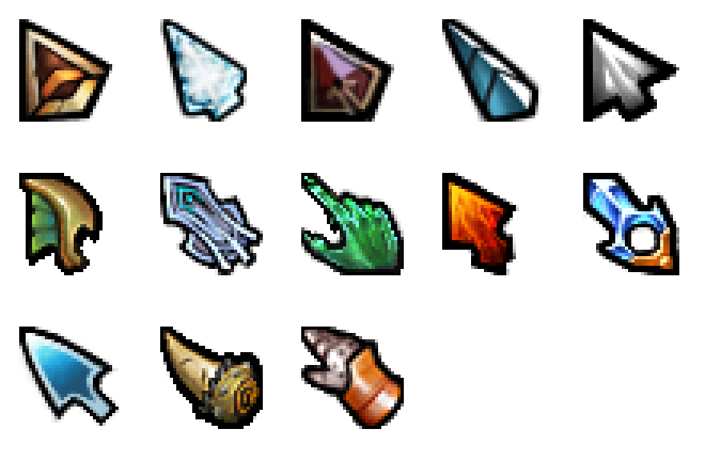
</p>

## Install

```bash
git clone https://github.com/0443n/dota2-cursors-linux
cd dota2-cursors-linux

./install.sh --list                      # see all packs
./install.sh dota2-pw-mirana --apply     # install and set active
```

`--apply` also switches your active cursor, detecting GNOME, KDE, XFCE, and
MATE. `--system` installs to `/usr/share/icons` for everyone on the machine and
needs sudo. If you'd rather skip the script, copy any folder from `themes/` into
`~/.local/share/icons/` and pick it in your desktop's cursor settings.

On Wayland you usually have to log out and back in before every app switches over.

## Packs

| Preview | Pack | `install.sh` name |
|---------|------|-------------------|
| 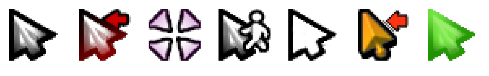 | Default | `dota2-default` |
| 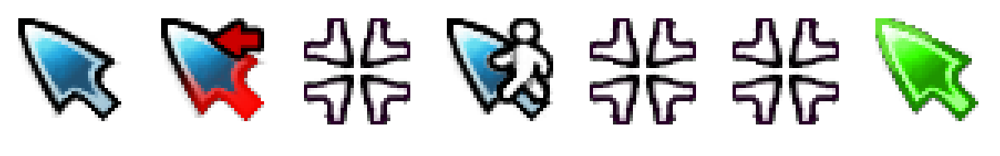 | Mirana | `dota2-pw-mirana` |
| 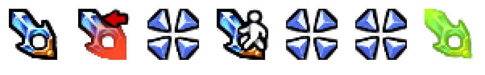 | Crystal Maiden | `dota2-pw-crystal-maiden` |
| 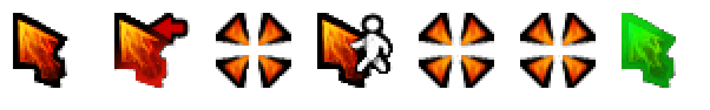 | Chaos Knight | `dota2-pw-chaos` |
| 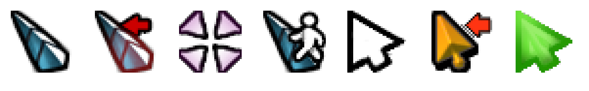 | Venomancer | `dota2-dcveno` |
| 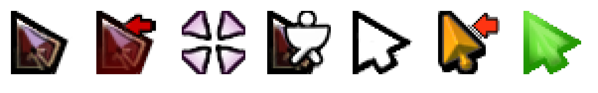 | Timbersaw | `dota2-dctimber-fancy` |
| 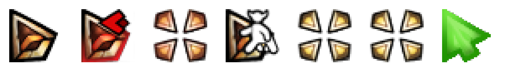 | Centaur Warrunner | `dota2-berserker-centaur` |
| 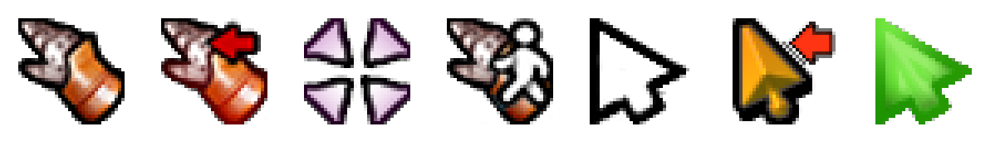 | Clockwerk | `dota2-war-machine-clockwork` |
| 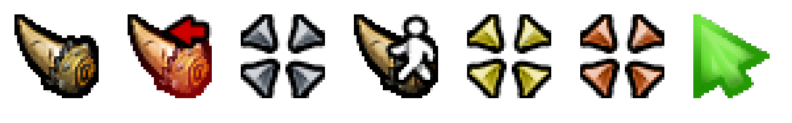 | Earthshaker | `dota2-sltv-shaker` |
| 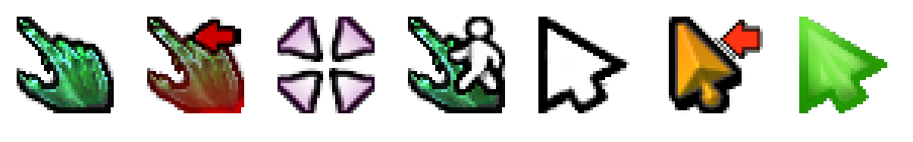 | Necro | `dota2-necronub` |
| 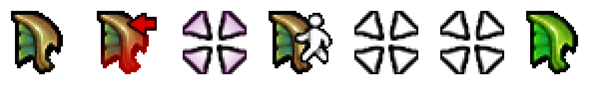 | Emerald Ocean | `dota2-emerald-ocean` |
| 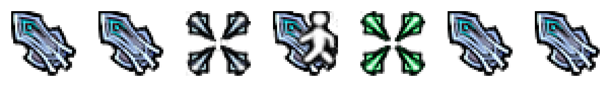 | Guardian of the Holy Flame | `dota2-guardian-of-the-holy-flame` |
| 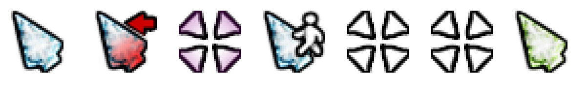 | BTS | `dota2-bts3` |

Each row shows, left to right: arrow, link, crosshair, move, drag, not-allowed, help.

## Notes

The cursors are static. Dota's cursor files are single frames; the glow and
motion you see in-game are added by the engine while you play, not stored in the
art. These are the same images, standing still.

They're 32x32, the size Dota ships them at. That looks fine on a normal display.
On a high-DPI screen they come out small unless your desktop scales cursors up
for you.

Dota has no text caret, busy spinner, or resize handles, so those three reuse
the arrow and move cursors instead of borrowing from another theme.

## About the artwork

This is a fan project. It isn't affiliated with Valve, and Valve hasn't endorsed
it. The cursors are Valve's artwork, pulled out of Dota 2 for personal desktop
use, and this repo doesn't claim to own any of it. If you're from Valve and want
it gone, open an issue and it comes down.
